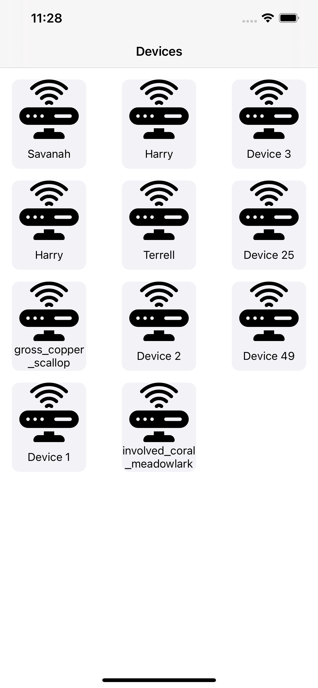
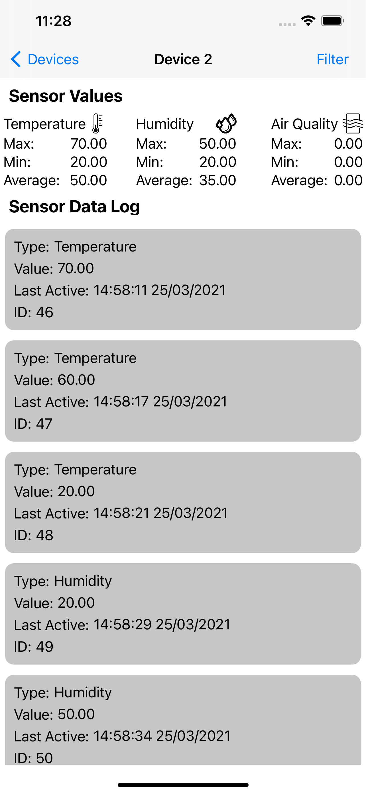
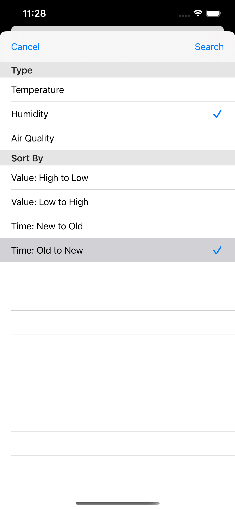

<h1 id="sensorData">SensorDataApp</h1>

SensorData App fetches data about sensor devices which has connected to system and displays them on main screen. When users click specific device, they can see temperature, humidity or air quality sensor data log on the detail screen. Maximum, minimum and average of these data also shown on this screen. With clicking filter button, user can filter sensor data according to type or time which they were created. The data which are fetched from API are saved in core data.

<h1 id="technologies-used">Technologies Used</h1>
<ul>
<li>UIKit</li>
<li>MVVM</li>
<li>Dependency Injection</li>
<li>Protocol Oriented Programming</li>
<li>Delegation Pattern</li>
<li>Alamofire</li>
<li>Core Data</li>
<li>Unit Testing</li>
<li>UICollectionView</li>
<li>UITableView</li>
<li>UIStackView</li>
</ul>
<h1 id="getting-started">Getting Started</h1>

Download the zip project or clone it. Run "pod install" command for installing Alamofire. Then open .xcworkspace project. 

<h1 id="compatibility">Compatibility</h1>

This project is written in Swift 5.0 and Xcode 12 is used.

<h1 id="images">Images</h1>

    

    

    
    

    
    

        

      

    

